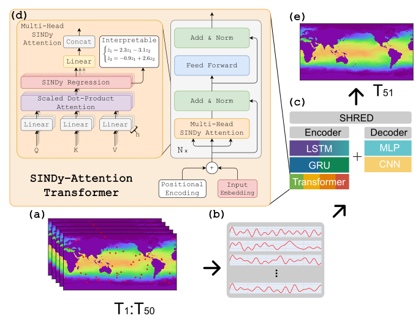

# Transformer SINDy-SHRED

<div align="center">

[](https://opensource.org/licenses/MIT)
[](https://arxiv.org/abs/2506.15881)
[](https://pytorch.org/)

[Overview](#overview) • [Project Structure](#project-structure) • [Getting Started](#getting-started)  • [Citation](#citation)

</div>

## Overview



T-SHRED is a method for sparse-sensor reconstruction of physical dynamics that utilizes a novel SINDy-Attention head to enable one-shot long-term forecasting in the latent space.

This repository contains all the necessary code to reproduce the results in our [paper](https://arxiv.org/abs/2506.15881) as well as running a wide range of different SHRED architectures. Encoders and decoders for SHRED models can be swapped out interchangeably. 

## Project Structure

```
.
├── apptainer
├── checkpoints
├── configs
├── datasets
├── figures
├── LICENSE
├── Makefile
├── notebooks
├── paper_figures
├── pickles
├── pyproject.toml
├── README.md
├── results
├── scripts
├── src
└── submodules
```

- `apptainer`:
  - Contains `apptainer.def` for creating a container on hyak.
- `checkpoints`: 
  - Contains the saved models during running. Each run, we save the model with the best "validation" score as well as the "latest" model as determined by the number of epochs run.
- `configs`:
  - Contains configuration files for running models or hyperparameter tuning them.
- `datasets`: 
  - Please download the datsets into the respective folders, this is the expected structure.
- `figures`: 
  - Folder to store figures.
- `LICENSE`:
  - Contains the license for the code.
- `Makefile`;
  - Contains project makefile. Currently just used for running 'black' to format the python files.
- `logs`: 
  - Folder to store logs.
- `notebooks`: 
  - Helpful notebooks. `ROM_plasma.ipynb` is David's example of running Plasma data. `the_well.ipynb` is how to parse The Well's data.
- `paper_figures`:
  - Contains figures used in the paper.
- `pyproject.tml`: 
  - Python environment file.
- `README.md`: 
  - This file
- `results`:
  - Output directory for hyperparameter optimization.
- `scripts`: 
  - Contains the primary entry-point `main.py` to training and evaluating a model.
- `slurms`: 
  - Contains hyak slurm files for batch runs.
- `src`: 
  - Contains primary package functions/code.
- `submodules`:
  - Project-used submodules.

## Getting Started

The environment is described in `pyproject.toml`. To install, please run:

```
$ pyenv install 3.13
$ pyenv local 3.13
$ python -m venv venv
$ source tshred/bin/activate
$ pip install .
```

The plasma and SST datasets are private. However, you can preprocess the `planetswe` dataset from [The Well](https://polymathic-ai.org/the_well/) by the following command

```
$(venv) python scripts/preprocess_the_well.py
```

To train a model, you can execute the following command:

```
$(venv) time python -u scripts/main.py --dataset planetswe --encoder vanilla_transformer --decoder mlp --epochs 100 --save_every_n_epochs 10 --batch_size 5 --encoder_depth 1 --input_length 10 --hidden_size 20 --n_sensors 5 --n_heads 4 --identifier vanilla_transformer_example --verbose 2>&1 | tee logs/planetswe.txt
```

Alternatively, you can run from a configuration file:

```
$(venv) time python -u scripts/main.py --config configs/test/planetswe_sindy_attention_transformer_5_mlp_0.yaml
```

## Citation

If you used our repository in your own work, please cite our work:

```bibtex
@misc{yermakov2025tshred,
      title={T-SHRED: Symbolic Regression for Regularization and Model Discovery with Transformer Shallow Recurrent Decoders}, 
      author={Alexey Yermakov and David Zoro and Mars Liyao Gao and J. Nathan Kutz},
      year={2025},
      eprint={2506.15881},
      archivePrefix={arXiv},
      primaryClass={cs.LG},
      url={https://arxiv.org/abs/2506.15881}, 
}
```
